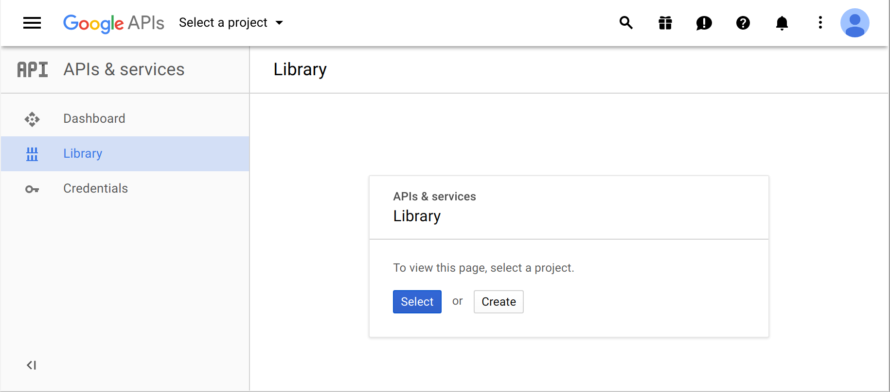
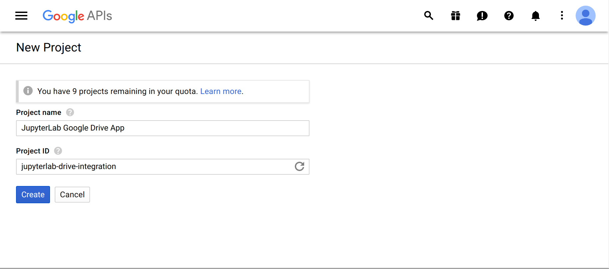
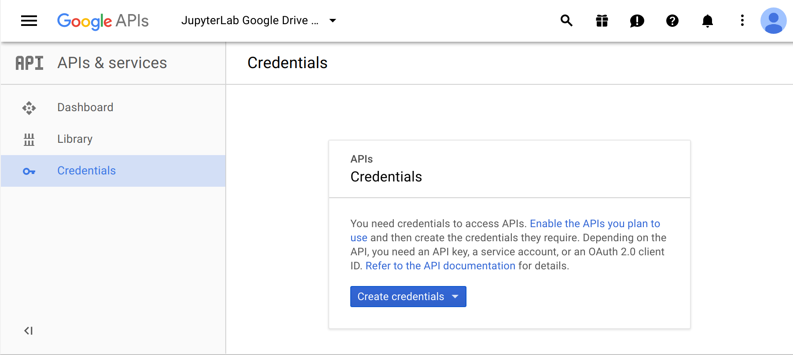
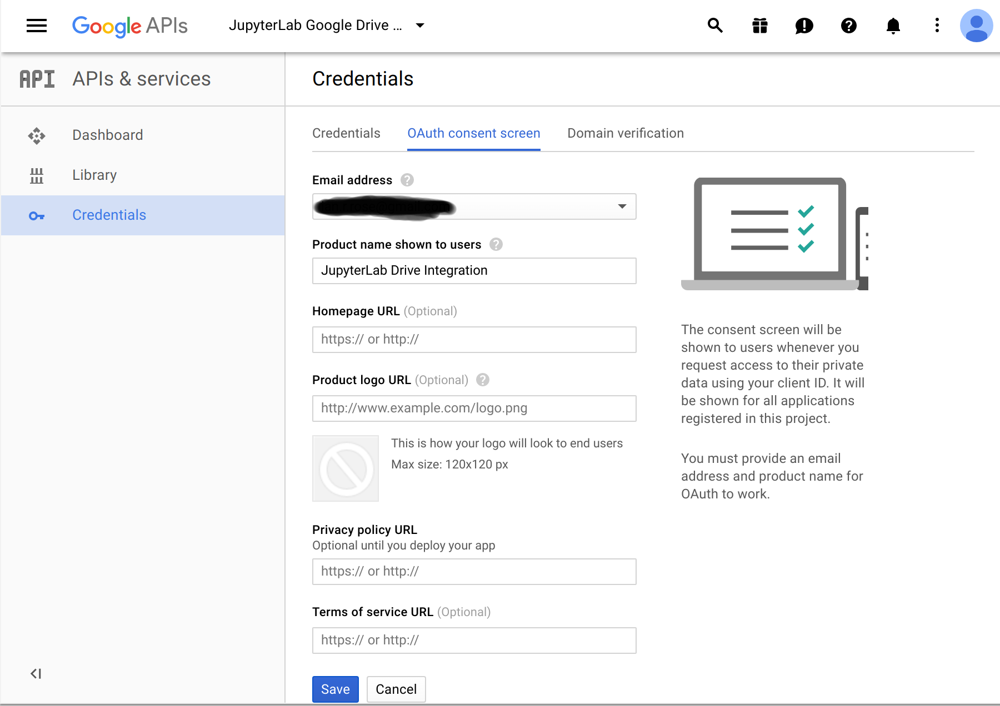
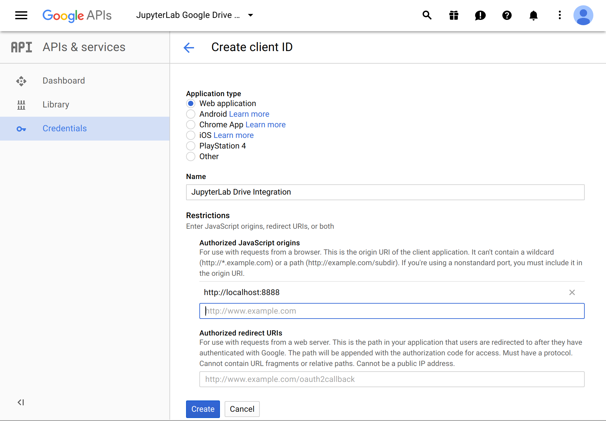
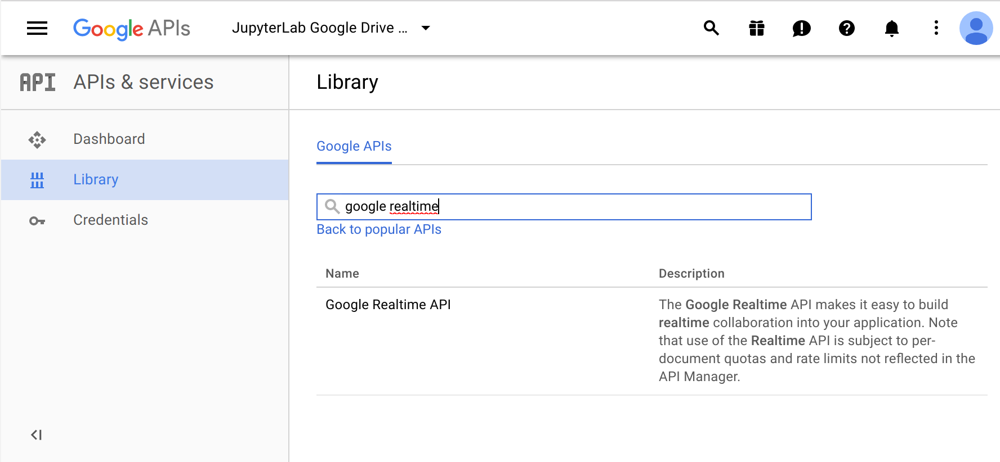
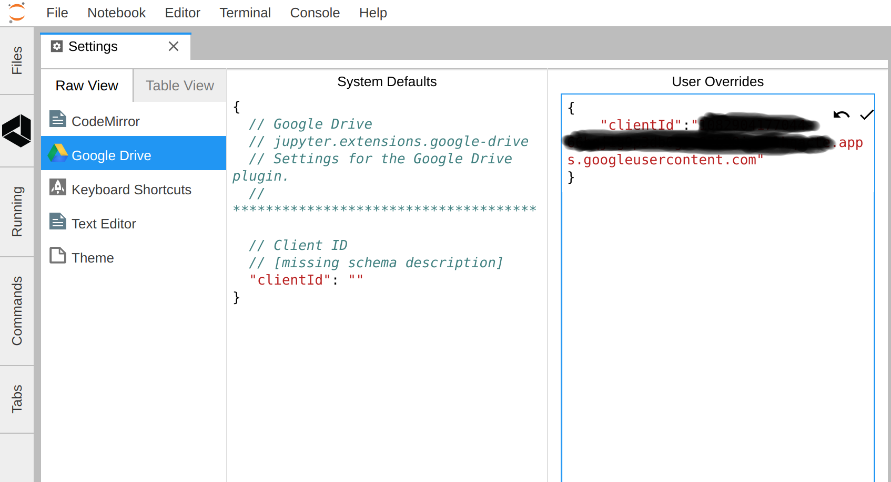

# Advanced Setup

The JupyterLab Google Drive extension makes authenticated requests to Google's servers,
and as such, must be configured to have the correct credentials.
In particular, the application must be registered with Google at the
[Google Developers Console](https://console.developers.google.com),
and the origin of the API requests must be pre-specified.
By default, the `@jupyterlab/google-drive` package uses a registered web application
that is configured to accept requests from `http://localhost`, ports `8888` through `8899`.
This is probably sufficient for local usage of the extension,
but if you are accessing the application from other origins
(such as you might do using a JupyterHub deployment),
or if you are using the extension extensively,
you will likely want to set up your own credentials with Google.

### Setup instructions
These instructions follow the ones outlined [here](https://developers.google.com/identity/sign-in/web/devconsole-project),
which should be considered authoritative.

1. Go to the [API Console](https://console.developers.google.com/projectselector/apis/library),
and select `Create` to create a new project.

2. Choose a name for the project.

3. In the **API Manager** sidebar, select **Credentials**, then select **OAuth client ID** from the **Create credentials** dropdown.

4. Click the **Configure consent screen** button and fill out the form. This configures the Google OAuth popup that will ask users for consent to use their account.

5. Select **Web application** for the application type, and provide a name for the application.
6. Under **Authorized Javascript Origins**, provide a list of URLs that will be accessing the APIs (e.g., `http://localhost:8888` or `https://www.myawsesomedeployment.org`).

7. The console will now show a **Client ID** field under the **Credentials** panel. This is the ID that will be used in the settings for the `@jupyterlab/google-drive` extension.
8. In the **API Manager** sidebar, select **Library**. This will provide an interface for enabling different Google APIs for the application. You will need to enable three APIs for the extension to work: **Google Drive API**, **Google Realtime API** and **Google Picker API**.

The Dashboard panel should now show be showing those APIs:

Once these steps have been completed, you will be able to use these credentials in the extension.
In the `jupyterlab.google-drive` settings of the settings registry, set the **clientID** field to be the client id provided by the developer console. If everything is configured properly, you should be able to use the application with your new credentials.

